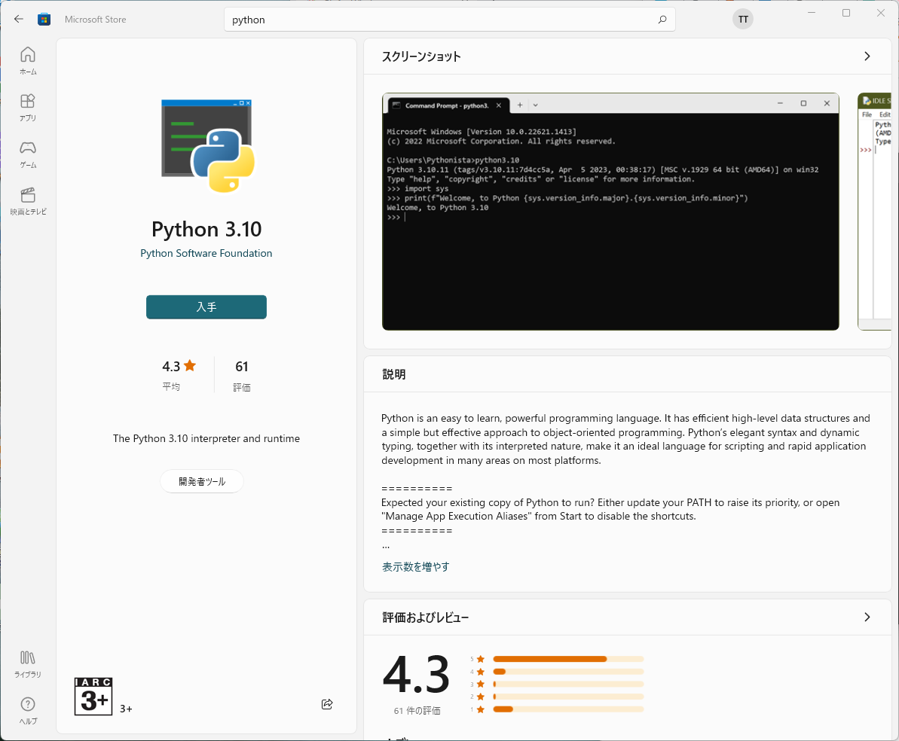
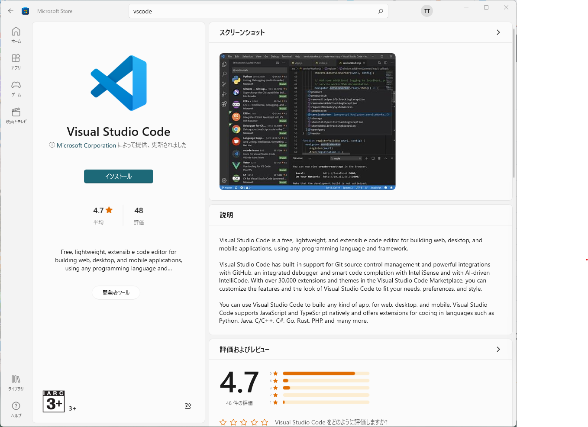
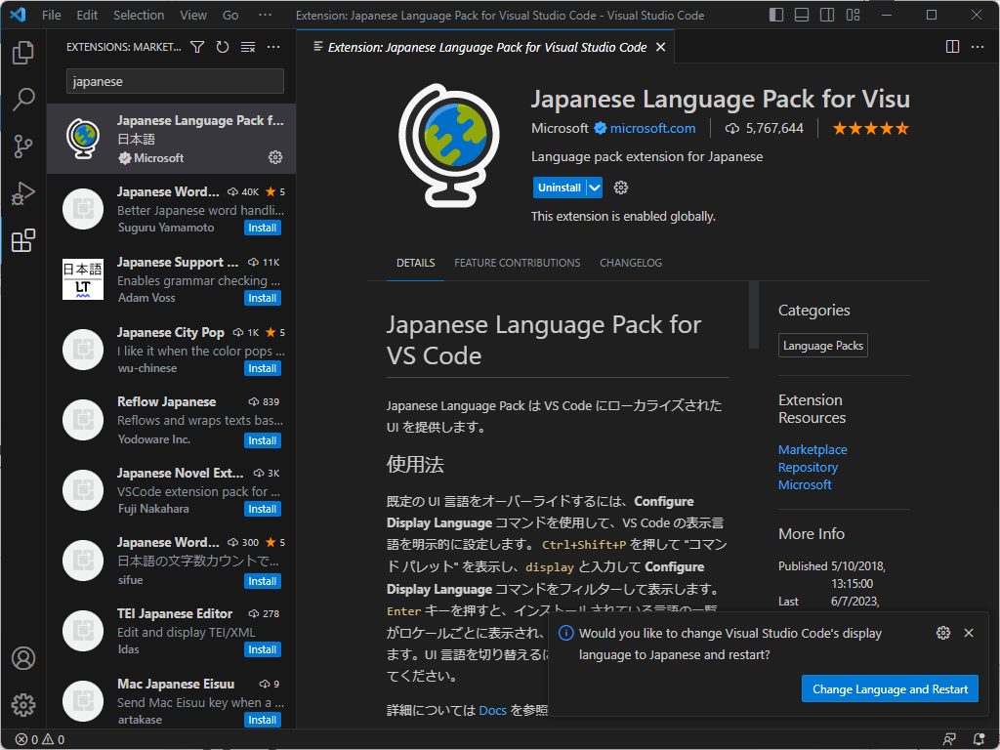
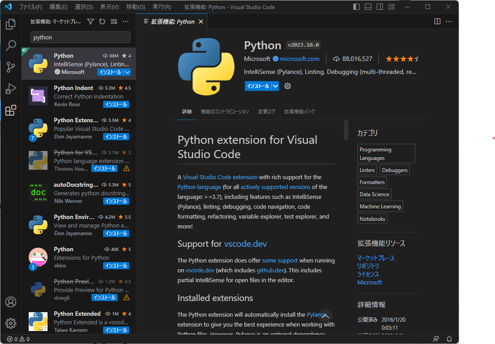
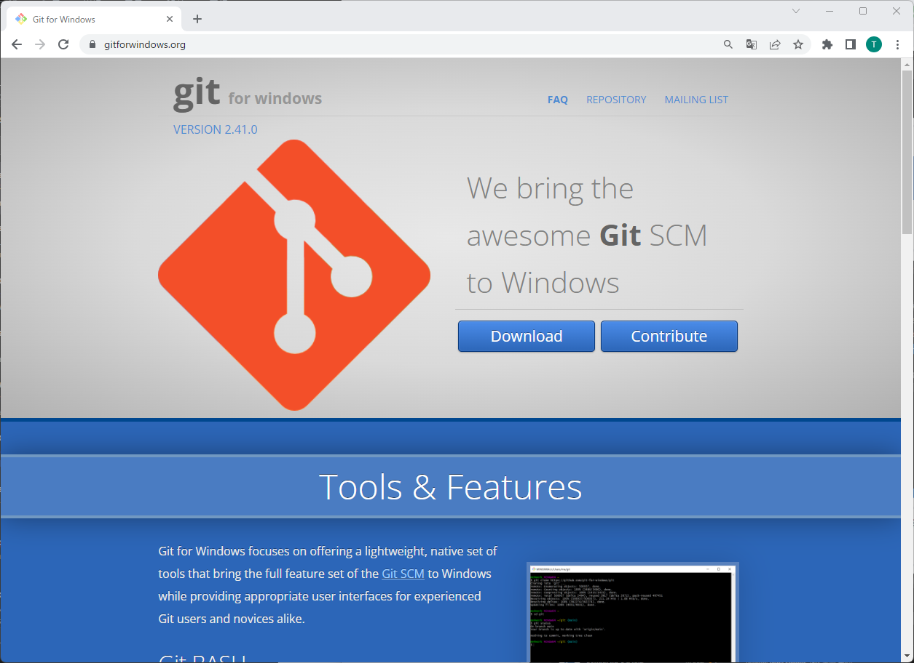
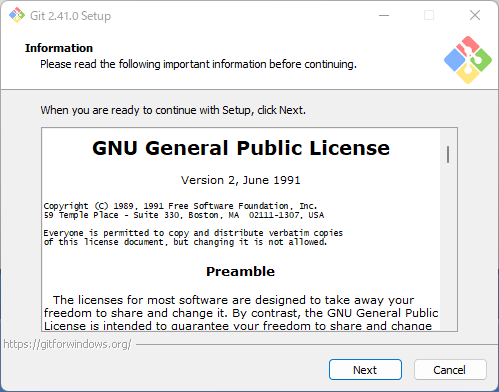
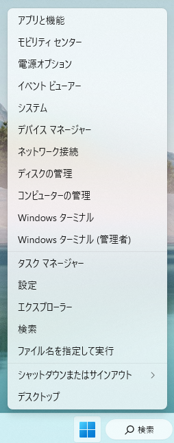
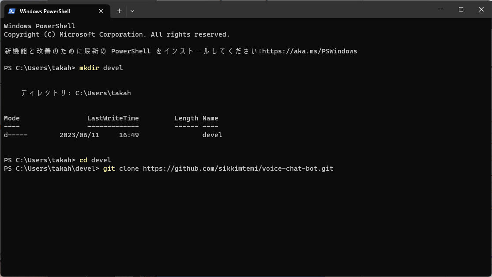
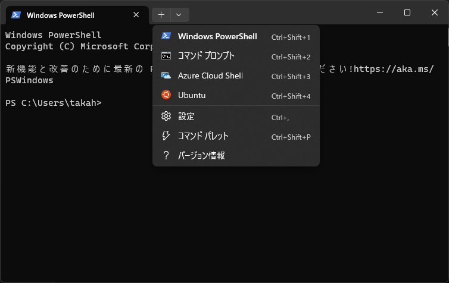

# Windows環境における環境構築方法

## Pythonのインストール

Microsoft StoreでPythonを検索してください。2023年６月現在、最新版は3.11ですが、3.10を選択してインストールしてください。3.11をインストールすると、Playsoundが動作しない可能性があります。



## VSCodeのインストール

Microsoft StoreでVSCodeを検索し、インストールしてください。



### 日本語環境の設定

VSCodeを起動し、左側に並んだアイコンの中から拡張機能（Extensions）をクリックしてください。検索窓に「japanese」と入力し、日本語の拡張機能をインストールしてください。インストールが完了すると、右下に「Change Language and Restart」というボタンが表示されるので、クリックしてください。VSCodeが再起動し、メニューが日本語表示になります。



### Python拡張機能のインストール

拡張機能で「python」と入力し、Python拡張機能をインストールしてください。



## Git for Windowsのインストール

[Git for Windows](https://gitforwindows.org/)のサイトからインストーラをダウンロードし、インストールしてください。



インストーラーの設定はすべてデフォルトのままで構いません。



## 開発用のディレクトリを作成する

スタートボタンを右クリックして、「ターミナル」を選択してください。



次のコマンドを入力して、開発用のディレクトリを作成してください。ここでは、ディレクトリ名を「devel」としていますが、任意の名前で構いません。

```shell
mkdir devel
```

## サンプルコードのダウンロード

次のコマンドを入力して、サンプルコードをダウンロードしてください。

```shell
cd devel
git clone https://github.com/sikkimtemi/voice-chat-bot.git
```



## venvの設定

ターミナルのタブの右側にあるアイコンをクリックして、コマンドプロンプトを起動してください。



コマンドプロンプトで次のコマンドを入力して、venvを設定してください。

```shell
cd devel
cd voice-chat-bot
python -m venv venv
cd venv/Scripts
activate.bat
```

つづいて、次のコマンドを入力して、必要なライブラリをインストールしてください。

```shell
cd ../..
pip install -r requirements.txt
```

## VSCodeのインタープリターの設定

VSCodeが起動していたら、いったん終了し、コマンドプロンプトで次のコマンドを入力してください。

```shell
code .
```

VSCodeが起動したら、右下のPythonのバージョンを確認してください。3.10.6('venv':venv)と表示されていれば、変更の必要はありません。venvの表記がない場合は、Pythonのバージョンをクリックして、「インタープリターの選択」でvenvを選択してください。